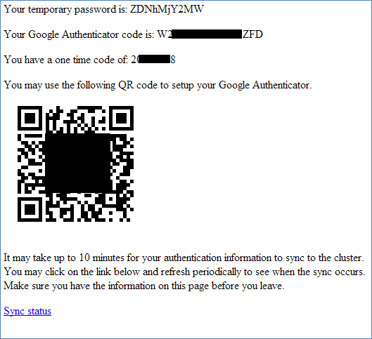
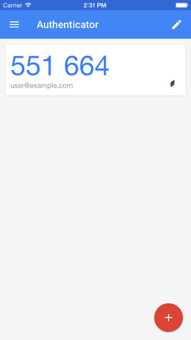
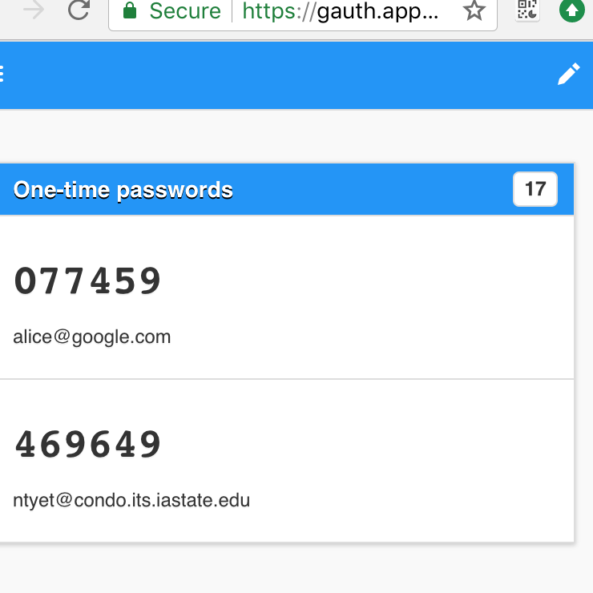

```{r, echo=FALSE}
library(knitr)
knitr::knit_hooks$set(inline = as.character)
knitr::opts_chunk$set(cache=T, echo = F, fig.height = 5, results="hide", message=F, warning = F)
knitr::opts_knit$set(eval.after = 'fig.cap')
```

# Setup

## Access

- Contact [hpc-help@iastate.edu](hpc-help@iastate.edu) for an account. 
- Install [Google Authenticator](http://hpcgroup.public.iastate.edu/HPC/Condo/IGA.html) on a mobile phone.
- Follow the instructions in the setup email.

## Setup instruction email



## Google Authenticator displays verification codes on your phone.




## Google Authenticator displays verification codes on your Chrome.



## Login

- Choose a login node.
    - headnode: `ssh <user>@condo.its.iastate.edu`
    
- Enter the verification code from Google Authenticator.
- Enter your password.


# Usage

## Folders

- Home directory for miscellaneous files: `/home/<user>`
- Most cluster jobs: `/work/<group>/<user>`
- Cluster jobs with large data files: `/ptmp/<group>/<user>`


## Transfer  Data 

- Use [FileZilla](https://www.hpc.iastate.edu/guides/file-transfers) 


## Submit an R job on Condo.  

- Log in and set up your work directory

```
ssh <user>@condo.its.iastate.edu
or
ssh<user>@condo2017.its.iastate.edu
```

```
mkdir /work/<group>/<user>
cd /work/<group>/<user>
```

- [Create a `simple.script`](https://www.hpc.iastate.edu/guides/classroom-hpc-cluster/slurm-job-script-generator)
- Submit the job with 

`qsub simple.script`

- Check the job status with `qstat -u <user>` or `qtop <jobID> `.
- If needed, delete the job with `qdel <jobID>`.

# Resources

## Condo links

- [hpc website](https://www.hpc.iastate.edu/)

- [hpc-help@iastate.edu](hpc-help@iastate.edu)

- The HPC group maintains a [script writer](https://www.hpc.iastate.edu/guides/classroom-hpc-cluster/slurm-job-script-generator)
to help us prepare jobs.

## Some Books about Writing

- *Style: Lessons in Clarity and Grace*, Joseph M Williams and Joseph Bizup
    - https://www.amazon.com/Style-Lessons-Clarity-Grace-11th/dp/0321898680
    - https://sites.duke.edu/niou/files/2014/07/WilliamsJosephM1990StyleTowardClarityandGrace.pdf

- *A Manual for Writers of Research Papers, Theses, and Dissertations*, Kate Turrabian
    - https://www.amazon.com/Manual-Writers-Research-Dissertations-Seventh/dp/0226823369
    - http://jcs.edu.au/wp-content/uploads/2016/09/A-manual-for-writers-of-research-papers-theses-and-dissertations.pdf

- *How to Write a Lot: A Practical Guide to Productive Academic Writing*, Paul J. Silvia
    - https://www.amazon.com/How-Write-Lot-Practical-Productive/dp/1591477433

## Some Books about R, Data Science
- [*Advanced R*, Hadley Wickham](http://adv-r.had.co.nz/)
- [*R for Data Science*, Garrett Grolemund, Hadley Wickham](http://r4ds.had.co.nz/)
- [*bookdown: Authoring Books and Technical Documents with R Markdown*, Yihue Xie](https://bookdown.org/yihui/bookdown/)
- [*blogdown:blogdown: Creating Websites with R Markdown*, Yihui Xie, Amber Thomas, Alison Presmanes Hill](https://bookdown.org/yihui/blogdown/)

## Some Rtools for  Reproducible Research 

- [*Steps toward reproducible research*, Karl Broman](https://www.biostat.wisc.edu/~kbroman/presentations/steps2rr.pdf)
- [*drake* R package, Will Landau et. al](https://github.com/ropensci/drake)


